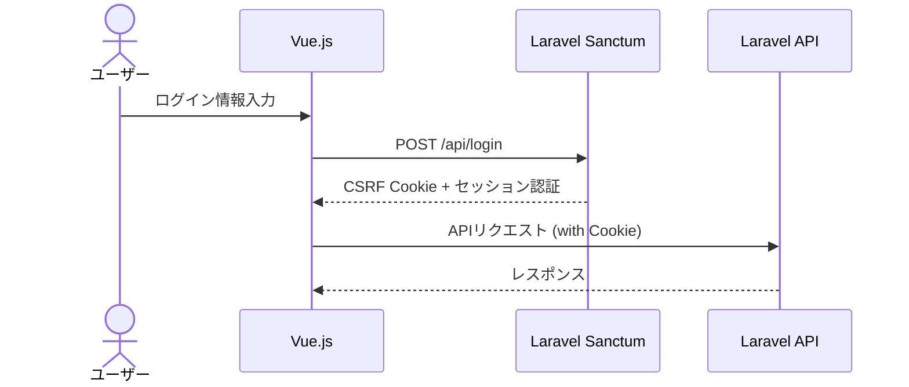

# API設計

本ドキュメントでは、AI-SaaS テンプレートのAPI設計について説明します。RESTful APIの原則に従い、JSON形式でデータをやり取りします。

## 1. 認証方式

### 1.1 認証フロー

API認証にはLaravel Sanctumを使用し、SPA（Single Page Application）認証を実装します。



### 1.2 認証エンドポイント

| エンドポイント | メソッド | 説明 |
|--------------|---------|------|
| `/api/login` | POST | ユーザーログイン |
| `/api/logout` | POST | ユーザーログアウト |
| `/api/user` | GET | 認証済みユーザー情報取得 |

### 1.3 APIトークン

モバイルアプリやサードパーティ連携用に、APIトークン認証も提供します。

```
Authorization: Bearer {api_token}
```

## 2. エンドポイント一覧

### 2.1 テナント管理 API

| エンドポイント | メソッド | 説明 | アクセス権限 |
|--------------|---------|------|------------|
| `/api/tenants` | GET | テナント一覧取得 | super_admin |
| `/api/tenants` | POST | テナント作成 | super_admin |
| `/api/tenants/{id}` | GET | テナント詳細取得 | super_admin, tenant_admin* |
| `/api/tenants/{id}` | PUT | テナント更新 | super_admin, tenant_admin* |
| `/api/tenants/{id}` | DELETE | テナント削除 | super_admin |

*tenant_adminは自分のテナントのみアクセス可能

### 2.2 ユーザー管理 API

| エンドポイント | メソッド | 説明 | アクセス権限 |
|--------------|---------|------|------------|
| `/api/users` | GET | ユーザー一覧取得 | super_admin, tenant_admin* |
| `/api/users` | POST | ユーザー作成 | super_admin, tenant_admin* |
| `/api/users/{id}` | GET | ユーザー詳細取得 | super_admin, tenant_admin*, 本人 |
| `/api/users/{id}` | PUT | ユーザー更新 | super_admin, tenant_admin*, 本人 |
| `/api/users/{id}` | DELETE | ユーザー削除 | super_admin, tenant_admin* |
| `/api/users/{id}/settings` | GET | ユーザー設定取得 | super_admin, tenant_admin*, 本人 |
| `/api/users/{id}/settings` | PUT | ユーザー設定更新 | super_admin, tenant_admin*, 本人 |

*tenant_adminは自分のテナント内のユーザーのみアクセス可能

### 2.3 トラッキングタグ API

| エンドポイント | メソッド | 説明 | アクセス権限 |
|--------------|---------|------|------------|
| `/api/tracking-tags` | GET | タグ一覧取得 | 認証済みユーザー* |
| `/api/tracking-tags` | POST | タグ作成 | 認証済みユーザー* |
| `/api/tracking-tags/{id}` | GET | タグ詳細取得 | 認証済みユーザー* |
| `/api/tracking-tags/{id}` | PUT | タグ更新 | 認証済みユーザー* |
| `/api/tracking-tags/{id}` | DELETE | タグ削除 | 認証済みユーザー* |
| `/api/tracking-tags/{id}/code` | GET | タグ設置コード取得 | 認証済みユーザー* |

*自分のテナントのタグのみアクセス可能

### 2.4 トラッキングイベント API

| エンドポイント | メソッド | 説明 | アクセス権限 |
|--------------|---------|------|------------|
| `/api/tracking-events` | POST | イベント記録 | 公開API（タグキー認証） |
| `/api/tracking-events` | GET | イベント一覧取得 | 認証済みユーザー* |
| `/api/tracking-events/stats` | GET | イベント統計取得 | 認証済みユーザー* |
| `/api/tracking-events/export` | GET | イベントデータエクスポート | 認証済みユーザー* |

*自分のテナントのイベントのみアクセス可能

### 2.5 AI分析・提案 API

| エンドポイント | メソッド | 説明 | アクセス権限 |
|--------------|---------|------|------------|
| `/api/ai/analyze` | POST | トラッキングデータ分析 | 認証済みユーザー* |
| `/api/ai/suggestions` | GET | AI提案一覧取得 | 認証済みユーザー* |
| `/api/ai/suggestions/{id}` | GET | AI提案詳細取得 | 認証済みユーザー* |

*自分のテナントのデータのみアクセス可能

### 2.6 システム設定 API

| エンドポイント | メソッド | 説明 | アクセス権限 |
|--------------|---------|------|------------|
| `/api/settings` | GET | システム設定一覧取得 | super_admin |
| `/api/settings` | PUT | システム設定一括更新 | super_admin |
| `/api/settings/{key}` | GET | 特定設定取得 | super_admin |
| `/api/settings/{key}` | PUT | 特定設定更新 | super_admin |

## 3. リクエスト/レスポンス仕様

### 3.1 共通ヘッダー

#### リクエストヘッダー

```
Accept: application/json
Content-Type: application/json
X-CSRF-TOKEN: {csrf_token}  // Cookie認証時
Authorization: Bearer {api_token}  // トークン認証時
```

#### レスポンスヘッダー

```
Content-Type: application/json
X-RateLimit-Limit: {rate_limit}
X-RateLimit-Remaining: {remaining_requests}
```

### 3.2 共通レスポンス形式

#### 成功レスポンス

```json
{
  "success": true,
  "data": {
    // レスポンスデータ
  },
  "meta": {
    // ページネーション情報など
  }
}
```

#### エラーレスポンス

```json
{
  "success": false,
  "error": {
    "code": "error_code",
    "message": "エラーメッセージ",
    "details": {
      // 詳細エラー情報
    }
  }
}
```

### 3.3 ステータスコード

| コード | 説明 |
|-------|------|
| 200 | OK - リクエスト成功 |
| 201 | Created - リソース作成成功 |
| 204 | No Content - 成功（返却データなし） |
| 400 | Bad Request - リクエスト不正 |
| 401 | Unauthorized - 認証エラー |
| 403 | Forbidden - 権限エラー |
| 404 | Not Found - リソース未発見 |
| 422 | Unprocessable Entity - バリデーションエラー |
| 429 | Too Many Requests - レート制限超過 |
| 500 | Internal Server Error - サーバーエラー |

### 3.4 ページネーション

一覧取得APIはページネーションをサポートします。

#### リクエストパラメータ

```
/api/users?page=2&per_page=15
```

#### レスポンス

```json
{
  "success": true,
  "data": [
    // ユーザーデータの配列
  ],
  "meta": {
    "current_page": 2,
    "per_page": 15,
    "total": 45,
    "total_pages": 3
  },
  "links": {
    "first": "/api/users?page=1&per_page=15",
    "prev": "/api/users?page=1&per_page=15",
    "next": "/api/users?page=3&per_page=15",
    "last": "/api/users?page=3&per_page=15"
  }
}
```

### 3.5 フィルタリングとソート

一覧取得APIはフィルタリングとソートをサポートします。

```
/api/tracking-events?filter[event_type]=click&sort=-created_at
```

## 4. 主要エンドポイント詳細

### 4.1 ログイン

#### リクエスト

```
POST /api/login
```

```json
{
  "email": "user@example.com",
  "password": "password",
  "remember": true
}
```

#### レスポンス

```json
{
  "success": true,
  "data": {
    "user": {
      "id": 1,
      "name": "ユーザー名",
      "email": "user@example.com",
      "role": "tenant_admin",
      "tenant_id": 5,
      "last_login_at": "2023-03-15T09:30:00Z"
    },
    "token": "api_token_string"  // APIトークン認証時のみ
  }
}
```

### 4.2 トラッキングタグ作成

#### リクエスト

```
POST /api/tracking-tags
```

```json
{
  "name": "ホームページCTAボタン",
  "description": "トップページの申し込みボタンのトラッキング"
}
```

#### レスポンス

```json
{
  "success": true,
  "data": {
    "id": 123,
    "tenant_id": 5,
    "user_id": 1,
    "name": "ホームページCTAボタン",
    "tag_key": "a1b2c3d4-e5f6-7890-abcd-ef1234567890",
    "description": "トップページの申し込みボタンのトラッキング",
    "is_active": true,
    "created_at": "2023-03-15T10:30:00Z",
    "updated_at": "2023-03-15T10:30:00Z"
  }
}
```

### 4.3 トラッキングイベント記録

#### リクエスト

```
POST /api/tracking-events
```

```json
{
  "tag_key": "a1b2c3d4-e5f6-7890-abcd-ef1234567890",
  "event_type": "click",
  "page_url": "https://example.com/",
  "element_id": "cta-button",
  "element_class": "btn btn-primary",
  "event_data": {
    "button_text": "今すぐ申し込む",
    "position": "header"
  }
}
```

#### レスポンス

```json
{
  "success": true,
  "data": {
    "id": 456789,
    "event_id": "evt_a1b2c3d4e5f6"
  }
}
```

### 4.4 AI分析リクエスト

#### リクエスト

```
POST /api/ai/analyze
```

```json
{
  "tag_id": 123,
  "date_range": {
    "start": "2023-03-01",
    "end": "2023-03-15"
  },
  "analysis_type": "conversion_optimization"
}
```

#### レスポンス

```json
{
  "success": true,
  "data": {
    "analysis_id": "anl_a1b2c3d4e5f6",
    "status": "processing",
    "estimated_completion_time": "2023-03-15T11:05:00Z"
  }
}
```

## 5. レート制限

APIには以下のレート制限が適用されます：

| エンドポイント | 制限 | 期間 | 適用範囲 |
|--------------|------|------|---------|
| 認証エンドポイント | 10リクエスト | 1分 | IPアドレスごと |
| 一般API | 60リクエスト | 1分 | ユーザーごと |
| トラッキングイベント記録 | 1000リクエスト | 1分 | タグキーごと |
| AI分析 | 10リクエスト | 1時間 | テナントごと |

## 6. エラーコード

| エラーコード | 説明 |
|------------|------|
| `auth_failed` | 認証失敗 |
| `invalid_credentials` | 認証情報不正 |
| `validation_error` | バリデーションエラー |
| `resource_not_found` | リソースが見つからない |
| `permission_denied` | 権限不足 |
| `rate_limit_exceeded` | レート制限超過 |
| `server_error` | サーバーエラー |
| `invalid_tag_key` | 無効なタグキー |
| `tenant_inactive` | テナント無効 |
| `ai_service_unavailable` | AI分析サービス利用不可 |

## 7. APIバージョニング

APIはバージョニングをサポートし、URLパスにバージョンを含めることができます：

```
/api/v1/users
```

デフォルトでは最新バージョンが使用されます。 