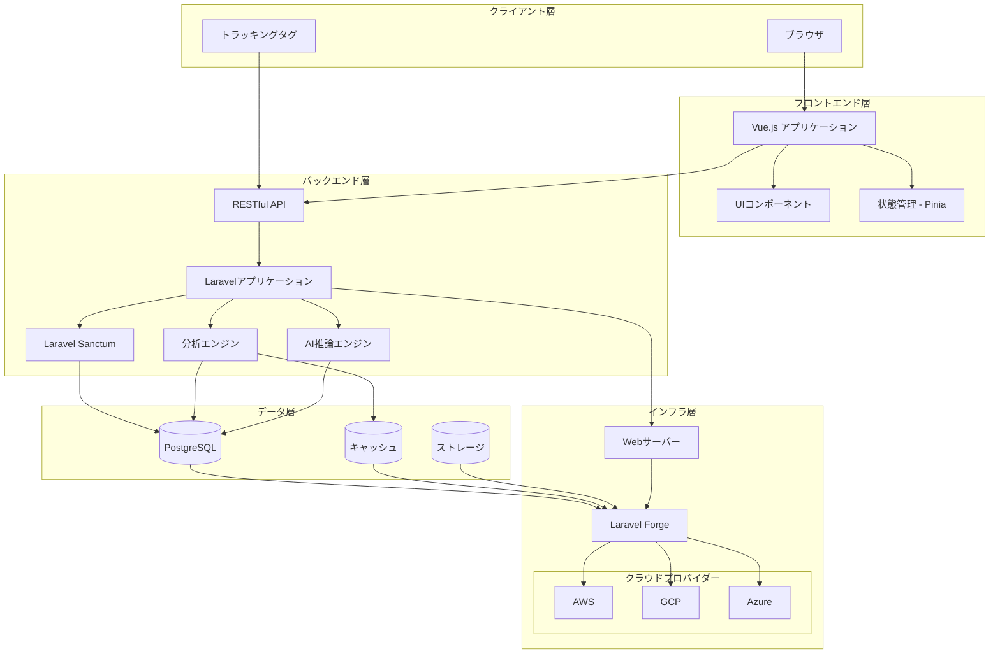
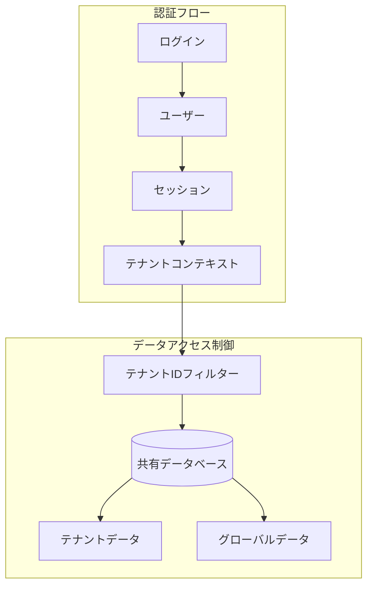
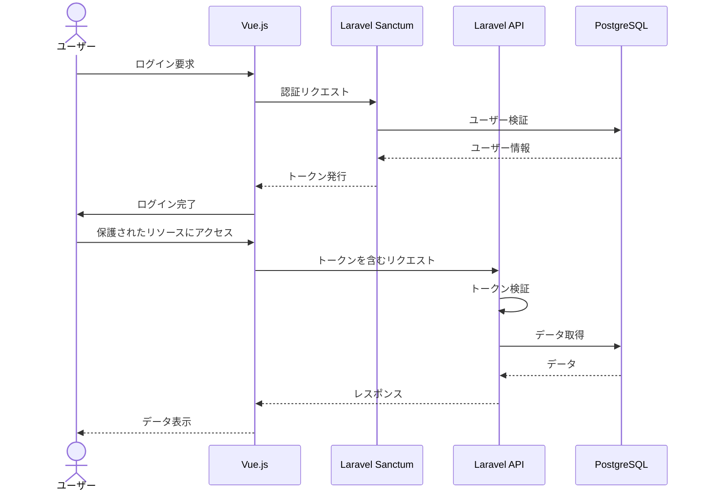
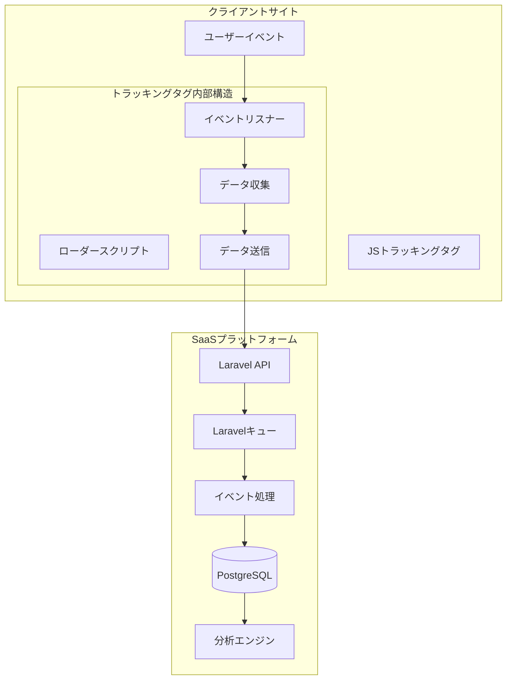
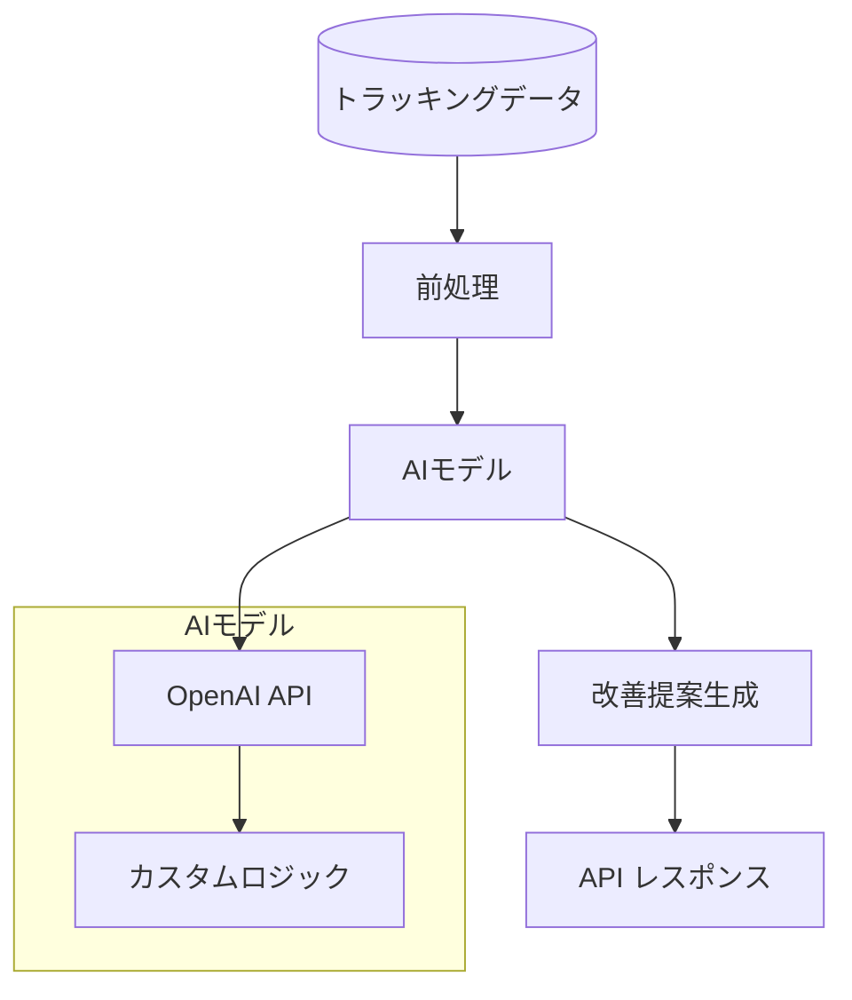
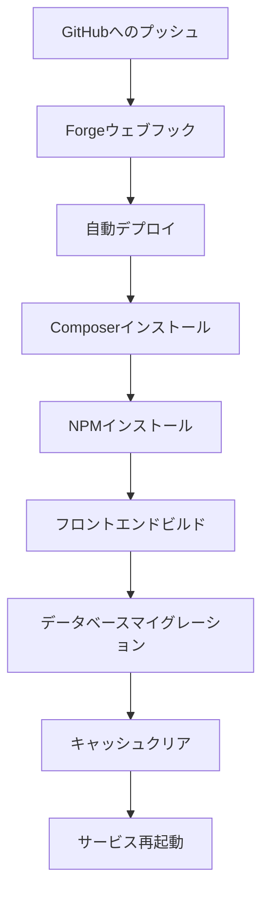
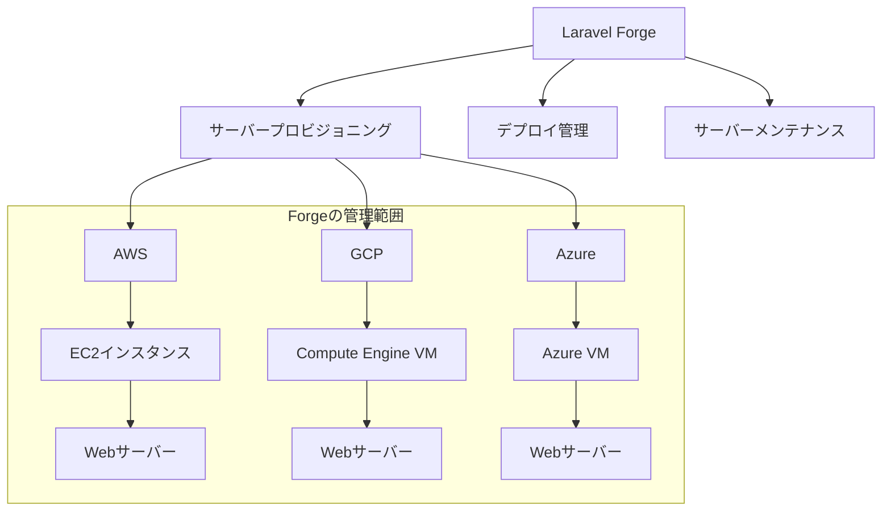

# システムアーキテクチャ設計

本ドキュメントでは、Laravel+Vue.jsベースのAI-SaaS テンプレートのシステムアーキテクチャ設計について説明します。

## 1. システム構成図



## 2. 技術スタック選定

### 2.1 フロントエンド

| 技術 | バージョン | 用途 |
|------|------------|------|
| Vue.js | 3.x | フロントエンドフレームワーク |
| Composition API | - | Vue.js 3の機能的APIスタイル |
| TypeScript | 5.x | 型安全な開発言語 |
| Pinia | 2.x | 状態管理 |
| Tailwind CSS | 3.x | スタイリング |
| Vue Router | 4.x | ルーティング |
| Axios | 1.x | HTTPクライアント |
| Vee-Validate | 4.x | フォームバリデーション |
| Chart.js | 4.x | データ可視化 |
| Day.js | 1.x | 日付操作 |
| Vanilla JavaScript | ES6+ | トラッキングタグ実装 |

### 2.2 バックエンド

| 技術 | バージョン | 用途 |
|------|------------|------|
| Laravel | 10.x | バックエンドフレームワーク |
| Laravel Sanctum | 3.x | API認証 |
| PHP | 8.2 | サーバーサイド言語 |
| PostgreSQL | 15.x | リレーショナルデータベース |
| Redis | 7.x | キャッシュ、キュー |
| OpenAI API | 最新 | AI機能 |
| Laravel Horizon | 最新 | キュー監視 |
| Laravel Telescope | 最新 | デバッグ・監視 |

### 2.3 インフラ構成

| 技術 | 用途 |
|------|------|
| Laravel Forge | サーバープロビジョニング、デプロイ自動化 |
| Nginx | Webサーバー |
| PHP-FPM | PHPプロセス管理 |
| Docker | コンテナ化（開発環境） |
| Docker Compose | 開発環境 |
| GitHub | ソースコード管理 |
| GitHub Actions | CI/CD |
| AWS/GCP/Azure | Laravel Forgeが管理するクラウドインフラ |

## 3. システムコンポーネント詳細

### 3.1 マルチテナント構成

AI-SaaS テンプレートはマルチテナントアーキテクチャを採用しています。各テナントは論理的に分離され、以下の特徴があります：

#### 3.1.1 設計思想

- **現在の実装：1テナント＝1管理者**
  - シンプルで管理が容易な設計を採用
  - テナントが直接認証の主体となる（ユーザーという概念は使用しない）
  - テナントに認証・権限情報を直接保持（email, password, role等）

- **将来の拡張性への配慮**
  - テナント内での複数ユーザー管理への拡張を想定
  - 例：企業アカウントでの社員管理、チーム内でのロール管理
  - そのため「テナント」という用語を一貫して使用し、「ユーザー」という用語は避ける
  - 将来的なユーザーテーブルの追加に対応できる設計

#### 3.1.2 現在の実装詳細

- 単一データベース内でテナントIDによる分離
- ユーザー認証ベースのテナント識別（URLやドメインによる分離は行わない）
- 全テナント関連テーブルに「tenant_id」カラムを含める
- LaravelミドルウェアとEloquentのグローバルスコープを活用
- 共有データ（プラン情報、グローバル設定等）は専用テーブルで管理



#### 3.1.3 認証・認可の設定

```php
// config/sanctum.php
return [
    'expiration' => 60 * 24,     // アクセストークン：24時間
    'refresh_ttl' => 20160,      // リフレッシュトークン：2週間（分単位）
];

// config/session.php
return [
    'lifetime' => 120,           // セッション：2時間
    'expire_on_close' => false,
    'secure' => env('SESSION_SECURE_COOKIE', true),
];
```

#### 3.1.4 CORS設定（開発環境）

```php
// config/cors.php
return [
    'paths' => ['api/*', 'sanctum/csrf-cookie'],
    'allowed_methods' => ['*'],
    'allowed_origins' => [
        'http://localhost:3000',
        'http://localhost:8000',
        'http://127.0.0.1:3000',
        'http://127.0.0.1:8000'
    ],
    'allowed_headers' => ['*'],
    'exposed_headers' => [],
    'max_age' => 0,
    'supports_credentials' => true,
];
```

### 3.2 認証・認可フロー

ユーザー認証と認可は次のフローで処理されます：



### 3.3 コンバージョントラッカーの仕組み

コンバージョントラッカーは純粋なJavaScript（Vanilla JS）で実装され、以下の仕組みで動作します：



#### 3.3.1 トラッキングタグの実装詳細

トラッキングタグは以下の特徴を持つVanilla JavaScriptで実装されます：

- **軽量設計**: ページ読み込み速度への影響を最小限に抑える
- **非同期ロード**: ページのレンダリングをブロックしない
- **クロスブラウザ対応**: 主要ブラウザすべてで動作
- **プライバシー対応**: 必要最小限のデータのみ収集

```javascript
// トラッキングタグの基本構造例
(function(w, d, t, u, n, a, m) {
    w['TrackingObject'] = n;
    w[n] = w[n] || function() {
        (w[n].q = w[n].q || []).push(arguments)
    };
    a = d.createElement(t);
    m = d.getElementsByTagName(t)[0];
    a.async = 1;
    a.src = u;
    m.parentNode.insertBefore(a, m)
})(window, document, 'script', 'https://tracking.example.com/tracker.js', 'track');

// 設定
track('init', 'TENANT_ID');
track('trackPageView');
```

#### 3.3.2 データ収集と送信フロー

1. **イベント検出**: クリック、フォーム送信、ページ離脱などのイベントを検出
2. **データ収集**: イベント情報、ユーザーエージェント、タイムスタンプなどを収集
3. **バッファリング**: 複数イベントをバッファリングして一括送信（オプション）
4. **送信**: Beacon API または XMLHttpRequest を使用してサーバーに送信
5. **エラー処理**: 送信失敗時のリトライロジック

#### 3.3.3 サーバーサイド処理

1. **データ受信**: Laravel APIエンドポイントがデータを受信
2. **バリデーション**: データの検証と不正リクエストのフィルタリング
3. **キュー登録**: 処理をキューに登録（高負荷時の対策）
4. **データ処理**: イベントデータの正規化と集計
5. **保存**: PostgreSQLデータベースへの保存
6. **リアルタイム分析**: 必要に応じてリアルタイム分析処理

### 3.4 AI推論エンジン

AI推論エンジンは以下のコンポーネントで構成されます：



## 4. スケーラビリティと拡張性

システムは以下の点でスケーラビリティと拡張性を確保しています：

- リポジトリパターンによるビジネスロジックの分離
- Laravel+Vue.jsの標準的なアーキテクチャによる拡張性
- キャッシュ戦略によるパフォーマンス最適化
- キューシステムによる非同期処理
- 水平スケーリング可能なインフラ設計

## 5. セキュリティ設計

システムは以下のセキュリティ対策を実装しています：

- Laravel Sanctumによる認証
- CSRFトークン保護
- XSS対策
- SQLインジェクション対策
- レート制限
- データの暗号化（保存時および転送時）
- HTTPS通信の強制
- 定期的なセキュリティ監査

## 6. デプロイ戦略

### 6.1 Laravel Forgeによるデプロイ

Laravel Forgeを使用して、以下のデプロイプロセスを実装します：



### 6.2 デプロイ環境

| 環境 | 用途 | 構成 |
|------|------|------|
| 開発環境 | ローカル開発 | Docker Compose |
| ステージング環境 | テスト・検証 | Laravel Forge + クラウドプロバイダー |
| 本番環境 | 実運用 | Laravel Forge + クラウドプロバイダー |

### 6.3 Laravel Forgeとクラウドプロバイダーとの関係

Laravel Forgeはクラウドプロバイダー（AWS/GCP/Azure）上のサーバーを管理するツールとして機能します：



Laravel Forgeの主な役割：

- クラウドプロバイダーのAPIを使用したサーバープロビジョニング
- サーバー環境の設定（PHP、Nginx、MySQL/PostgreSQL等）
- SSLの自動設定と更新
- デプロイメントスクリプトの管理と実行
- デーモン・スケジュールタスク・キューワーカーの管理
- データベースの管理

### 6.4 Laravel Forgeの利点

- サーバープロビジョニングの自動化
- ゼロダウンタイムデプロイ
- SSL証明書の自動管理
- データベース管理の簡素化
- スケジュールタスクの管理
- キューワーカーの管理
- サーバーモニタリング 