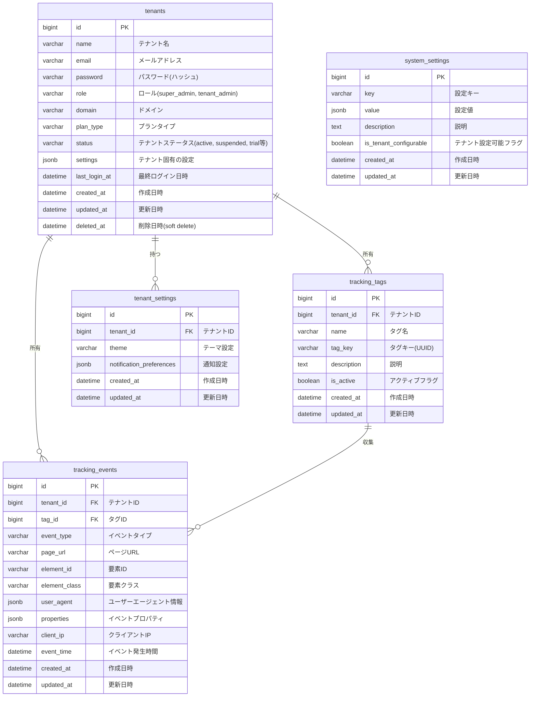

# データベース設計

本ドキュメントでは、AI-SaaS テンプレートのデータベース設計について説明します。マルチテナント構造を採用し、PostgreSQLを使用して実装します。

## 1. データベース設計の基本方針

### 1.1 マルチテナント対応

- 単一データベースで複数テナントのデータを管理
- テナントIDによるデータ分離を実現
- 共有データは専用テーブルで管理

### 1.2 設計思想

- **現在のデータモデル**
  - 1テナント＝1管理者の単純な構造
  - テナントテーブルに認証・権限情報を直接保持
  - ユーザーという概念は使用せず、テナントが直接認証の主体

- **将来の拡張性**
  - テナント内での複数ユーザー管理を想定した設計
  - テナントテーブルは組織・企業としての情報を保持
  - 将来的なユーザーテーブルの追加に対応可能な構造
  - 現時点では「テナント」という用語で統一し、拡張時の混乱を防止

## 2. ER図



## 3. テーブル定義書

### 3.1 tenants（テナント）テーブル

| カラム名 | データ型 | NULL | デフォルト | 説明 |
|---------|---------|------|-----------|------|
| id | bigint | No | auto_increment | 主キー |
| name | varchar(255) | No | - | テナント名 |
| email | varchar(255) | No | - | メールアドレス（ユニーク） |
| password | varchar(255) | No | - | パスワード（ハッシュ化） |
| role | enum | No | 'tenant_admin' | ロール（super_admin, tenant_admin） |
| domain | varchar(255) | Yes | NULL | ドメイン名 |
| plan_type | varchar(50) | No | 'free' | プランタイプ（free, basic, premium） |
| status | varchar(50) | No | 'active' | テナントステータス（active, suspended, trial） |
| settings | jsonb | Yes | NULL | テナント固有の設定 |
| last_login_at | timestamp | Yes | NULL | 最終ログイン日時 |
| created_at | timestamp | No | CURRENT_TIMESTAMP | 作成日時 |
| updated_at | timestamp | No | CURRENT_TIMESTAMP | 更新日時 |
| deleted_at | timestamp | Yes | NULL | 削除日時（論理削除用） |

### 3.2 tracking_tags（トラッキングタグ）テーブル

| カラム名 | データ型 | NULL | デフォルト | 説明 |
|---------|---------|------|-----------|------|
| id | bigint | No | auto_increment | 主キー |
| tenant_id | bigint | No | - | 外部キー（tenants.id） |
| name | varchar(255) | No | - | タグ名 |
| tag_key | varchar(36) | No | - | タグキー（UUID形式） |
| description | text | Yes | NULL | 説明 |
| is_active | boolean | No | true | アクティブフラグ |
| created_at | timestamp | No | CURRENT_TIMESTAMP | 作成日時 |
| updated_at | timestamp | No | CURRENT_TIMESTAMP | 更新日時 |

### 3.3 tracking_events（トラッキングイベント）テーブル

| カラム名 | データ型 | NULL | デフォルト | 説明 |
|---------|---------|------|-----------|------|
| id | bigint | No | auto_increment | 主キー |
| tenant_id | bigint | No | - | 外部キー（tenants.id） |
| tag_id | bigint | No | - | 外部キー（tracking_tags.id） |
| event_type | varchar(50) | No | - | イベントタイプ（click, view, submit等） |
| page_url | varchar(2048) | No | - | ページURL |
| element_id | varchar(255) | Yes | NULL | 要素ID |
| element_class | varchar(255) | Yes | NULL | 要素クラス |
| user_agent | jsonb | Yes | NULL | ユーザーエージェント情報 |
| properties | jsonb | Yes | NULL | イベントプロパティ |
| client_ip | varchar(45) | Yes | NULL | クライアントIP |
| event_time | timestamp | No | CURRENT_TIMESTAMP | イベント発生時間 |
| created_at | timestamp | No | CURRENT_TIMESTAMP | 作成日時 |
| updated_at | timestamp | No | CURRENT_TIMESTAMP | 更新日時 |

### 3.4 tenant_settings（テナント設定）テーブル

| カラム名 | データ型 | NULL | デフォルト | 説明 |
|---------|---------|------|-----------|------|
| id | bigint | No | auto_increment | 主キー |
| tenant_id | bigint | No | - | 外部キー（tenants.id） |
| theme | varchar(50) | Yes | 'light' | テーマ設定（light, dark, system） |
| notification_preferences | jsonb | Yes | NULL | 通知設定 |
| created_at | timestamp | No | CURRENT_TIMESTAMP | 作成日時 |
| updated_at | timestamp | No | CURRENT_TIMESTAMP | 更新日時 |

### 3.5 system_settings（システム設定）テーブル

| カラム名 | データ型 | NULL | デフォルト | 説明 |
|---------|---------|------|-----------|------|
| id | bigint | No | auto_increment | 主キー |
| key | varchar(255) | No | - | 設定キー（ユニーク） |
| value | jsonb | No | '{}' | 設定値 |
| description | text | Yes | NULL | 説明 |
| is_tenant_configurable | boolean | No | false | テナントごとに設定可能か |
| created_at | timestamp | No | CURRENT_TIMESTAMP | 作成日時 |
| updated_at | timestamp | No | CURRENT_TIMESTAMP | 更新日時 |


## 4. 主要テーブル定義例

### 4.1 テナントテーブル

```sql
CREATE TABLE tenants (
    id BIGSERIAL PRIMARY KEY,
    name VARCHAR(255) NOT NULL,
    email VARCHAR(255) NOT NULL,
    password VARCHAR(255) NOT NULL,
    role user_role NOT NULL DEFAULT 'tenant_admin',
    domain VARCHAR(255),
    plan_type VARCHAR(50) NOT NULL DEFAULT 'free',
    status VARCHAR(50) NOT NULL DEFAULT 'active',
    settings JSONB,
    last_login_at TIMESTAMP WITH TIME ZONE,
    created_at TIMESTAMP WITH TIME ZONE NOT NULL DEFAULT CURRENT_TIMESTAMP,
    updated_at TIMESTAMP WITH TIME ZONE NOT NULL DEFAULT CURRENT_TIMESTAMP,
    deleted_at TIMESTAMP WITH TIME ZONE
);

CREATE INDEX idx_tenants_domain ON tenants(domain);
CREATE INDEX idx_tenants_deleted_at ON tenants(deleted_at);
```

### 4.2 トラッキングタグテーブル

```sql
CREATE TABLE tracking_tags (
    id BIGSERIAL PRIMARY KEY,
    tenant_id BIGINT NOT NULL,
    name VARCHAR(255) NOT NULL,
    tag_key VARCHAR(36) NOT NULL,
    description TEXT,
    is_active BOOLEAN NOT NULL DEFAULT TRUE,
    created_at TIMESTAMP WITH TIME ZONE NOT NULL DEFAULT CURRENT_TIMESTAMP,
    updated_at TIMESTAMP WITH TIME ZONE NOT NULL DEFAULT CURRENT_TIMESTAMP,
    CONSTRAINT fk_tracking_tags_tenant FOREIGN KEY (tenant_id) REFERENCES tenants(id) ON DELETE CASCADE,
    CONSTRAINT tracking_tags_tag_key_unique UNIQUE(tag_key)
);

CREATE INDEX idx_tracking_tags_tenant_id ON tracking_tags(tenant_id);
CREATE INDEX idx_tracking_tags_tag_key ON tracking_tags(tag_key);
```

### 4.3 トラッキングイベントテーブル

```sql
CREATE TABLE tracking_events (
    id BIGSERIAL PRIMARY KEY,
    tenant_id BIGINT NOT NULL,
    tag_id BIGINT NOT NULL,
    event_type VARCHAR(50) NOT NULL,
    page_url VARCHAR(2048) NOT NULL,
    element_id VARCHAR(255),
    element_class VARCHAR(255),
    user_agent JSONB,
    properties JSONB,
    client_ip VARCHAR(45),
    event_time TIMESTAMP WITH TIME ZONE NOT NULL DEFAULT CURRENT_TIMESTAMP,
    created_at TIMESTAMP WITH TIME ZONE NOT NULL DEFAULT CURRENT_TIMESTAMP,
    updated_at TIMESTAMP WITH TIME ZONE NOT NULL DEFAULT CURRENT_TIMESTAMP,
    CONSTRAINT fk_tracking_events_tenant FOREIGN KEY (tenant_id) REFERENCES tenants(id) ON DELETE CASCADE,
    CONSTRAINT fk_tracking_events_tag FOREIGN KEY (tag_id) REFERENCES tracking_tags(id) ON DELETE CASCADE
);

CREATE INDEX idx_tracking_events_tenant_id ON tracking_events(tenant_id);
CREATE INDEX idx_tracking_events_tag_id ON tracking_events(tag_id);
CREATE INDEX idx_tracking_events_event_type ON tracking_events(event_type);
CREATE INDEX idx_tracking_events_event_time ON tracking_events(event_time);
```

### 4.4 テナント設定テーブル

```sql
CREATE TABLE tenant_settings (
    id BIGSERIAL PRIMARY KEY,
    tenant_id BIGINT NOT NULL,
    theme VARCHAR(50) DEFAULT 'light',
    notification_preferences JSONB,
    created_at TIMESTAMP WITH TIME ZONE NOT NULL DEFAULT CURRENT_TIMESTAMP,
    updated_at TIMESTAMP WITH TIME ZONE NOT NULL DEFAULT CURRENT_TIMESTAMP,
    CONSTRAINT fk_tenant_settings_tenant FOREIGN KEY (tenant_id) REFERENCES tenants(id) ON DELETE CASCADE
);

CREATE INDEX idx_tenant_settings_tenant_id ON tenant_settings(tenant_id);
```

## 5. マルチテナントクエリの実装例

### 5.1 Laravelグローバルスコープの例

```php
<?php

namespace App\Models\Scopes;

use Illuminate\Database\Eloquent\Builder;
use Illuminate\Database\Eloquent\Model;
use Illuminate\Database\Eloquent\Scope;
use Illuminate\Support\Facades\Auth;

class TenantScope implements Scope
{
    /**
     * すべてのクエリにテナントスコープを適用
     */
    public function apply(Builder $builder, Model $model)
    {
        if (Auth::check() && !app()->runningInConsole()) {
            $user = Auth::user();
            
            // スーパー管理者の場合はスコープを適用しない
            if ($user->role === 'super_admin') {
                return;
            }
            
            $builder->where($model->getTable() . '.tenant_id', $user->tenant_id);
        }
    }
}
```

### 5.2 マイグレーションの例

```php
<?php

use Illuminate\Database\Migrations\Migration;
use Illuminate\Database\Schema\Blueprint;
use Illuminate\Support\Facades\Schema;

return new class extends Migration
{
    /**
     * マイグレーションの実行
     */
    public function up(): void
    {
        // ロール定義
        Schema::create('roles', function (Blueprint $table) {
            $table->string('id')->primary();
            $table->string('name');
            $table->text('description')->nullable();
            $table->timestamps();
        });

        // テナントテーブル（ユーザー情報を含む）
        Schema::create('tenants', function (Blueprint $table) {
            $table->id();
            $table->string('name');
            $table->string('email')->unique();
            $table->string('password');
            $table->string('role')->default('tenant_admin');
            $table->string('domain')->nullable()->unique();
            $table->string('plan_type')->default('free');
            $table->string('status')->default('active');
            $table->jsonb('settings')->nullable();
            $table->timestamp('last_login_at')->nullable();
            $table->rememberToken();
            $table->timestamps();
            $table->softDeletes();

            $table->index('domain');
            $table->index('status');
            $table->index('plan_type');
            $table->foreign('role')->references('id')->on('roles');
        });

        // トラッキングタグテーブル
        Schema::create('tracking_tags', function (Blueprint $table) {
            $table->id();
            $table->foreignId('tenant_id')->constrained()->onDelete('cascade');
            $table->string('name');
            $table->string('tag_key', 36)->unique();
            $table->text('description')->nullable();
            $table->boolean('is_active')->default(true);
            $table->timestamps();

            $table->index('tenant_id');
            $table->index('tag_key');
        });

        // トラッキングイベントテーブル
        Schema::create('tracking_events', function (Blueprint $table) {
            $table->id();
            $table->foreignId('tenant_id')->constrained()->onDelete('cascade');
            $table->foreignId('tag_id')->constrained('tracking_tags')->onDelete('cascade');
            $table->string('event_type', 50);
            $table->string('page_url', 2048);
            $table->string('element_id', 255)->nullable();
            $table->string('element_class', 255)->nullable();
            $table->jsonb('user_agent')->nullable();
            $table->jsonb('properties')->nullable();
            $table->string('client_ip', 45)->nullable();
            $table->timestamp('event_time')->useCurrent();
            $table->timestamps();

            $table->index(['tenant_id', 'event_time']);
            $table->index(['tag_id', 'event_time']);
            $table->index('event_type');
        });

        // テナント設定テーブル
        Schema::create('tenant_settings', function (Blueprint $table) {
            $table->id();
            $table->foreignId('tenant_id')->constrained()->onDelete('cascade');
            $table->string('theme')->default('light');
            $table->jsonb('notification_preferences')->nullable();
            $table->timestamps();

            $table->index('tenant_id');
        });

        // システム設定テーブル
        Schema::create('system_settings', function (Blueprint $table) {
            $table->id();
            $table->string('key')->unique();
            $table->jsonb('value');
            $table->text('description')->nullable();
            $table->boolean('is_tenant_configurable')->default(false);
            $table->timestamps();

            $table->index('key');
        });
    }

    /**
     * マイグレーションの取り消し
     */
    public function down(): void
    {
        Schema::dropIfExists('tracking_events');
        Schema::dropIfExists('tracking_tags');
        Schema::dropIfExists('tenant_settings');
        Schema::dropIfExists('system_settings');
        Schema::dropIfExists('tenants');
        Schema::dropIfExists('roles');
    }
};
```

## 6. データベース最適化戦略

### 6.1 インデックス戦略

- 頻繁に検索・フィルタリングされるカラムにはインデックスを設定
- 複合インデックスを効果的に活用（tenant_id + created_at など）
- EXPLAIN ANALYZEを使用したクエリ分析と最適化

### 6.2 パーティショニング

トラッキングイベントテーブルなど、データ量が多くなるテーブルには以下のパーティション戦略を検討:

```sql
-- テーブルパーティショニングの例（時間ベース）
CREATE TABLE tracking_events (
    -- カラム定義
) PARTITION BY RANGE (event_time);

-- 月ごとのパーティション作成例
CREATE TABLE tracking_events_y2023m01 PARTITION OF tracking_events
    FOR VALUES FROM ('2023-01-01') TO ('2023-02-01');
```

### 6.3 キャッシュ戦略

- 頻繁にアクセスされるデータはRedisにキャッシュ
- テナント固有の設定やプリファレンスはキャッシュに保存
- アプリケーションレベルでのキャッシュ管理 