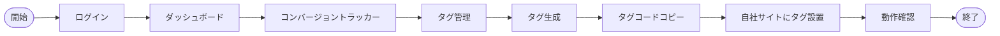

# 画面設計書

本ドキュメントでは、AI-SaaS テンプレートの画面設計について説明します。

## 1. 画面遷移図

### 1.1 スーパーユーザー画面遷移図

### 1.2 一般ユーザー画面遷移図

## 2. ユーザーフロー図

### 2.1 スーパーユーザーのユーザーフロー

#### 2.1.1 テナント管理フロー

#### 2.1.2 システム監視フロー

### 2.2 一般ユーザーのユーザーフロー

#### 2.2.1 トラッキングタグ設置フロー

#### 2.2.2 データ分析フロー

#### 2.2.3 CTA最適化フロー（AI提案機能付き）

## 3. アクセス権限表

| 画面/機能 | スーパーユーザー | 一般ユーザー |
|------------|-----------------|------------|
| ダッシュボード | ✅ | ✅ |
| テナント管理 | ✅ | ❌ |
| テナント詳細 | ✅ | ❌ |
| ユーザー管理（全体） | ✅ | ❌ |
| テナント内ユーザー管理 | ✅ | ❌ |
| システム設定 | ✅ | ❌ |
| コンバージョントラッカー | ✅（全テナント閲覧可） | ✅（自テナントのみ） |
| タグ管理 | ✅（全テナント閲覧可） | ✅（自テナントのみ） |
| データ分析 | ✅（全テナント閲覧可） | ✅（自テナントのみ） |
| AI改善提案 | ✅（全テナント閲覧可） | ✅（自テナントのみ） |
| 自分のプロフィール | ✅ | ✅ |
| ヘルプ/ドキュメント | ✅ | ✅ |

## 4. 画面レイアウト概要

以下に主要画面のレイアウト概要を示します。実際の開発では、これらの概要を元にしたデザインカンプやUIコンポーネントを作成します。

### 4.1 共通レイアウト
- **ヘッダー**: ロゴ、サイト名、ユーザーメニュードロップダウン
- **サイドバー**: 主要ナビゲーションメニュー（階層構造）
- **メインコンテンツエリア**: 各画面の主要コンテンツを表示
- **フッター**: コピーライト情報、リンク等

### 4.2 ダッシュボード画面
- ウェルカムメッセージ
- KPIカード（テナント数、ユーザー数、CTR等）
- アクティビティグラフ（時系列データ）
- 最近のアクティビティリスト

### 4.3 テナント管理画面
- アクションボタン（新規テナント作成等）
- 検索フィルター
- テナント一覧テーブル（ソート・フィルタ機能付き）
- ページネーション

### 4.4 コンバージョントラッカー
- **タグ管理**:
  - トラッキングタグコード表示（コピー機能付き）
  - 設置手順ガイド
  - 新規タグ作成機能

- **データ分析**:
  - 期間選択フィルター
  - データグラフ（クリックレート推移、CTA要素別クリック率等）
  - AI改善提案セクション

### 4.5 AI改善提案画面
- 分析対象CTA要素の選択
- 現在のパフォーマンス指標表示
- AI分析結果と改善提案リスト
- 改善案プレビュー
- 実装ガイダンス